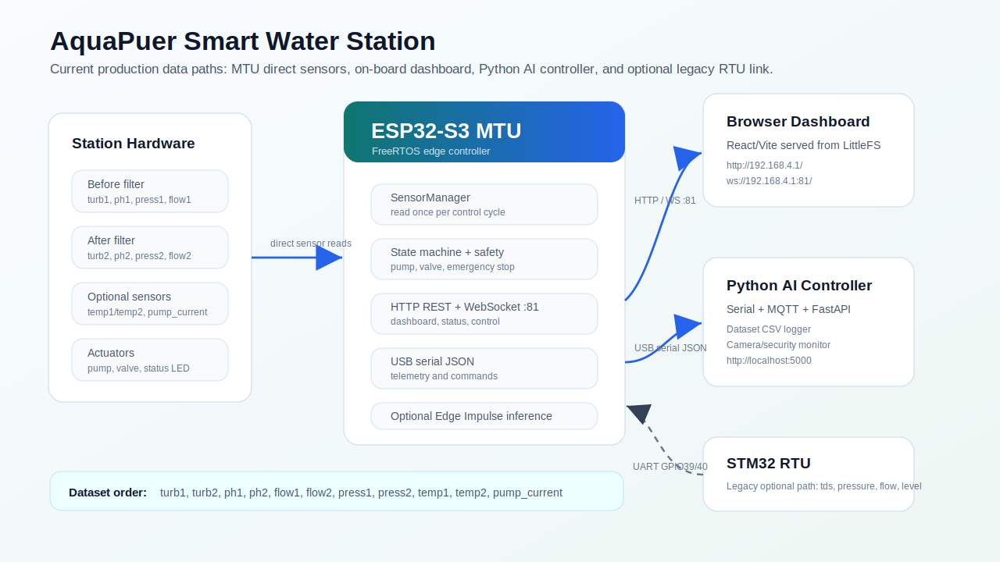
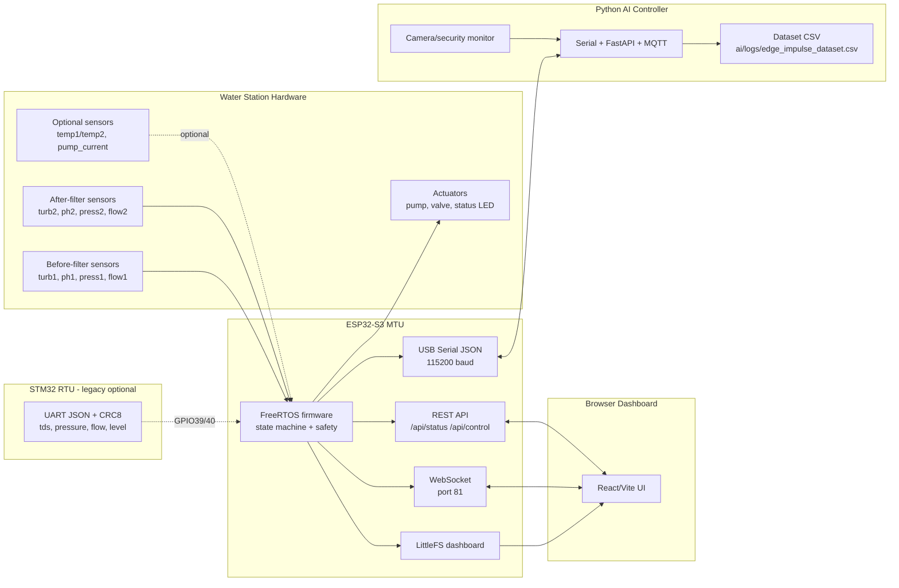

<div align="center">

# Smart Water Station

**water-treatment monitoring, control, dashboarding, and AI data capture**


</div>

---

## Overview

It is a graduation-project smart water station. The current build uses an
ESP32-S3 as the main controller for local sensors, pump/valve control, an
on-board web dashboard, REST/WebSocket APIs, serial telemetry, and optional Edge
Impulse inference. A Python controller can read the ESP32 serial stream, expose
FastAPI endpoints, mirror data through MQTT, run camera/security monitoring, and
save synchronized rows for Edge Impulse training.

The STM32 RTU project is still present and wired back into the MTU, but its
payload is currently the older 4-field format (`tds`, `pressure`, `flow`,
`level`). Treat it as optional/legacy until it is upgraded to the new
before/after-filter sensor schema.

## System Map





## Current Data Paths

| Path | Address / format | Purpose |
|---|---|---|
| ESP32 dashboard | `http://192.168.4.1/` | On-board UI served from LittleFS |
| ESP32 WebSocket | `ws://192.168.4.1:81/` | Live status broadcast and web commands |
| ESP32 REST | `http://192.168.4.1/api/*` | Status/config/control endpoints |
| ESP32 serial | JSON lines at `115200` baud | Python telemetry and commands |
| Python API | `http://localhost:5000` | Remote API, alerts, dataset status |
| Dataset output | `ai/logs/edge_impulse_dataset.csv` | Training rows for Edge Impulse |

## Project Layout

```text
Graduation Project/
|-- ai/                              # Python serial/MQTT/FastAPI/dataset controller
|   |-- api.py
|   |-- controller.py
|   |-- main.py
|   |-- config.json
|   `-- logs/
|-- firmware/
|   |-- MTU/                         # ESP32-S3 PlatformIO project
|   |   |-- src/                     # FreeRTOS, sensors, web server, AI service
|   |   |-- data/                    # Built web dashboard for LittleFS
|   |   |-- lib/edge_impulse/        # Exported Edge Impulse Arduino library
|   |   `-- platformio.ini
|   `-- RTU/                         # STM32 Blue Pill PlatformIO project
|       |-- src/
|       `-- platformio.ini
`-- web/
    `-- Smart-Water-Station-main/    # React/Vite dashboard source
        |-- app/
        |-- lib/use-water-station.ts
        |-- scripts/copy-dist-to-platformio.cjs
        `-- package.json
```

## Sensor Schema

The active MTU schema is based on before/after-filter sensor pairs:

| Field | Meaning | Current MTU source |
|---|---|---|
| `turb1`, `turb2` | Turbidity before/after filter | ESP32 ADC GPIO 4, 5 |
| `ph1`, `ph2` | pH before/after filter | ESP32 ADC GPIO 6, 7 |
| `flow1`, `flow2` | Flow before/after filter | ESP32 GPIO 14, 13 pulse counters |
| `press1`, `press2` | Pressure before/after filter | ESP32 ADC GPIO 8, 9 |
| `temp1`, `temp2` | Optional temperature sensors | disabled by default |
| `pump_current` | Optional pump-current sensor | disabled by default |
| `pump_on` | Pump state | MTU actuator state |

Dataset column order:

```text
timestamp_ms,turb1,turb2,ph1,ph2,flow1,flow2,press1,press2,temp1,temp2,pump_current,pump_on,state,error,label
```

Required sensors before Python writes a dataset row:

```text
turb1,turb2,ph1,ph2,flow1,flow2,press1,press2
```

## MTU Hardware Snapshot

| Setting | Current value |
|---|---|
| WiFi AP | `AquaPuer-MTU` / `12345678` |
| Dashboard | enabled, served from LittleFS |
| Simulation mode | disabled |
| RTU link | enabled |
| LCD I2C | SDA GPIO18, SCL GPIO17 |
| RTU UART | RX GPIO39, TX GPIO40 |
| Temperature sensors | optional, disabled |
| Pump-current sensor | optional, disabled |

RTU wiring:

```text
STM32 PA9  TX  -> ESP32 GPIO39 RX
STM32 PA10 RX  <- ESP32 GPIO40 TX
GND            -> GND
```

Use 3.3V UART logic only.

## Quick Start

### 1. Build and Deploy the Web Dashboard

```bash
cd web/Smart-Water-Station-main
npm install
npm run build:esp32
```

This builds the Vite app, copies it into `firmware/MTU/data`, and creates gzip
copies for the ESP32 server.

### 2. Flash the ESP32 MTU

```bash
cd ../../firmware/MTU
pio run -e esp32s3_n16r8 -t uploadfs
pio run -e esp32s3_n16r8 -t upload
```

`uploadfs` is required. If only firmware is uploaded, the ESP32 can boot while
the browser still shows an old page or a blank page.

### 3. Open the Station UI

```text
WiFi: AquaPuer-MTU
Password: 12345678
Dashboard: http://192.168.4.1/
```

### 4. Run the Python Controller

```bash
cd ai
pip install -r requirements.txt
python main.py
```

## API Summary

### ESP32 MTU

| Method | Endpoint | Purpose |
|---|---|---|
| `GET` | `/api/status` | Full station status |
| `POST` | `/api/control` | Pump/valve/reset/emergency commands |
| `GET` | `/api/config` | Firmware flags and thresholds |
| `GET` | `/api/ai` | Latest AI/Edge Impulse result |
| `GET` | `/health` | Filesystem and firmware health |
| `WS` | `:81/` | Live status and command channel |

### Python Controller

| Method | Endpoint | Purpose |
|---|---|---|
| `GET` | `/api/status` | Serial/MQTT/security/dataset status |
| `POST` | `/api/command` | Send command to MTU |
| `GET` | `/api/telemetry` | Latest serial telemetry |
| `GET` | `/api/dataset/status` | Dataset readiness and missing sensors |
| `POST` | `/api/dataset/label` | Set label for future dataset rows |
| `WS` | `/ws/live` | Python-side live stream |

## Command Format

```json
{"cmd":"SET_PUMP","state":true}
{"cmd":"SET_MODE","state":true}
{"cmd":"EMERGENCY_STOP","state":"ON"}
{"cmd":"RESET"}
```

## Verification

```bash
python -m compileall ai

cd web/Smart-Water-Station-main
npm run build
npm run build:esp32

cd ../../firmware/MTU
pio run -e esp32s3_n16r8
pio run -e esp32s3_n16r8 -t buildfs

cd ../RTU
pio run -e bluepill_f103c8
```

If `pio` is not available in the terminal but the VS Code PlatformIO extension
is installed, use the PlatformIO task buttons or the full PlatformIO virtualenv
path on the machine.

## Status Notes

- The web dashboard and MTU command format are aligned on WebSocket port `81`.
- The Python dataset logger and firmware Edge Impulse feature vector now share
  the same feature order.
- The STM32 RTU project still needs a payload upgrade before it fully matches
  the new before/after-filter schema.
