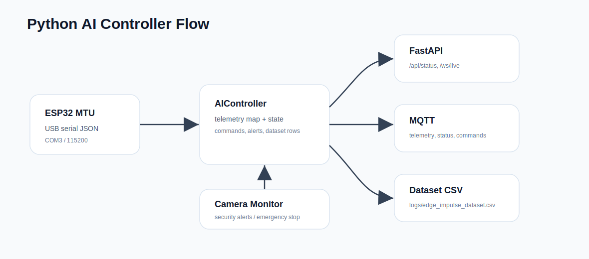
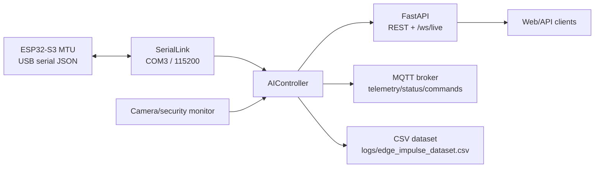

# AquaPuer AI Controller


The `ai` folder contains the Python side of the station. It is not only a
camera monitor: it also acts as a bridge between ESP32 serial telemetry, MQTT,
FastAPI/WebSocket clients, and Edge Impulse dataset logging.

## Runtime Flow





## Responsibilities

| Area | What it does |
|---|---|
| Serial | Connects to the MTU on `COM3` at 115200 baud by default |
| Telemetry | Reads JSON lines from the MTU and keeps the latest value per sensor |
| Commands | Sends shared command JSON back to the MTU |
| MQTT | Publishes telemetry/status/alerts and receives MQTT commands |
| FastAPI | Exposes REST endpoints and `/ws/live` |
| Security monitor | Runs camera detection and can send emergency stop on critical alerts |
| Dataset capture | Saves synchronized rows for Edge Impulse training |

## Current Sensor/Dataset Schema

The controller expects telemetry messages like:

```json
{"type":"telemetry","sensor":"turb1","value":12.3,"status":"OK","ts":1000}
```

Dataset rows are written to:

```text
ai/logs/edge_impulse_dataset.csv
```

Columns:

```text
timestamp_ms,turb1,turb2,ph1,ph2,flow1,flow2,press1,press2,temp1,temp2,pump_current,pump_on,state,error,label
```

Required sensors before a row is written:

```text
turb1,turb2,ph1,ph2,flow1,flow2,press1,press2
```

Optional fields:

```text
temp1,temp2,pump_current,pump_on,state,error
```

`temp1`, `temp2`, and `pump_current` can stay empty until the hardware is
installed and enabled in the MTU firmware.

## Configuration

Edit `config.json`.

Important blocks:

```json
"serial": {
  "port": "COM3",
  "baud_rate": 115200,
  "timeout": 1.0,
  "reconnect_delay": 3,
  "max_retries": 2
}
```

```json
"dataset": {
  "enabled": true,
  "file": "logs/edge_impulse_dataset.csv",
  "interval_seconds": 1.0,
  "label": "unlabeled",
  "required_sensors": ["turb1","turb2","ph1","ph2","flow1","flow2","press1","press2"]
}
```

```json
"api": {
  "enabled": true,
  "host": "0.0.0.0",
  "port": 5000
}
```

## Run

```bash
cd ai
pip install -r requirements.txt
python main.py
```

The log file is:

```text
ai/logs/water_station.log
```

`logs/` is for runtime output only: application logs and generated dataset CSV
files. It is not firmware input and it is not uploaded to the ESP32.

## API

Default server:

```text
http://localhost:5000
```

| Method | Endpoint | Description |
|---|---|---|
| `GET` | `/api/status` | Full controller status, telemetry, alerts, dataset state |
| `POST` | `/api/command` | Send command JSON to the MTU |
| `GET` | `/api/telemetry` | Latest serial telemetry map |
| `GET` | `/api/dataset/status` | Dataset rows, label, present/missing sensors |
| `POST` | `/api/dataset/label` | Change label used for future dataset rows |
| `GET` | `/api/alerts` | Current security alerts and recommendations |
| `GET` | `/api/security/stats` | Camera/model detection statistics |
| `GET` | `/api/health` | Serial, MQTT, camera, and model health |
| `WS` | `/ws/live` | Live stream for API clients |

Set a dataset label:

```bash
curl -X POST http://localhost:5000/api/dataset/label ^
  -H "Content-Type: application/json" ^
  -d "{\"label\":\"normal\"}"
```

Send a command:

```bash
curl -X POST http://localhost:5000/api/command ^
  -H "Content-Type: application/json" ^
  -d "{\"cmd\":\"SET_PUMP\",\"state\":\"ON\"}"
```

## Verification

```bash
python -m compileall ai
python -m pip check
```

The pinned NumPy range in `requirements.txt` keeps TensorFlow 2.19 compatible:

```text
numpy>=1.26.0,<2.2.0
```
