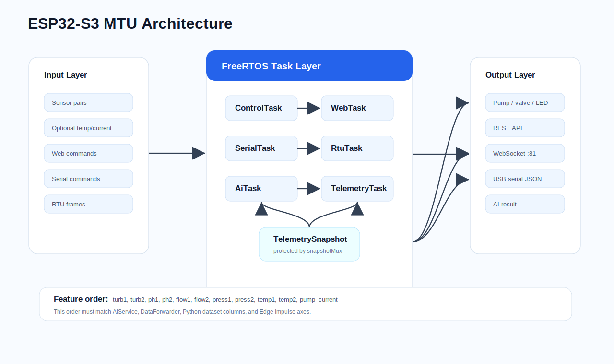
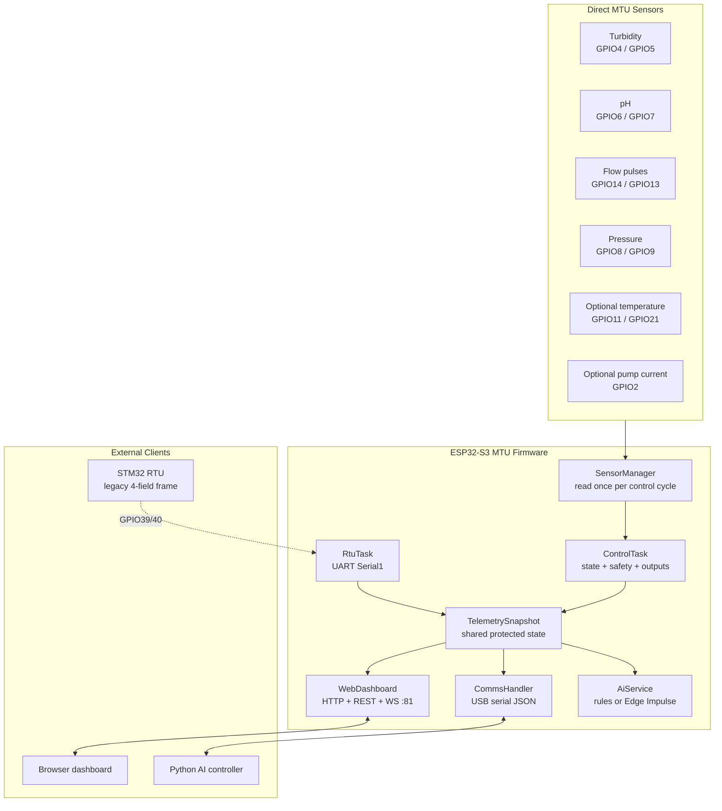
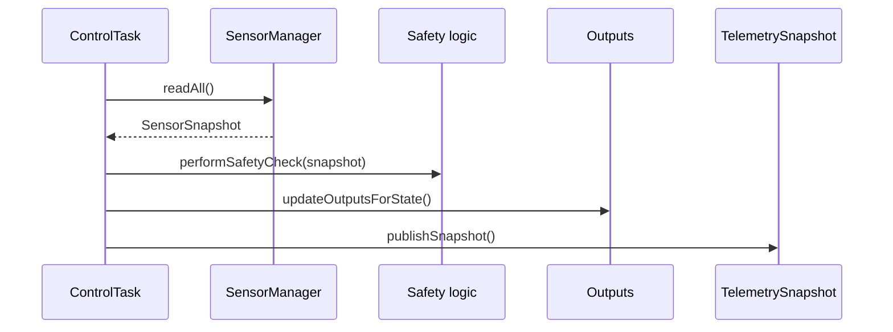

# Smart Water Station MTU Architecture v3.2

The MTU is the ESP32-S3 edge controller. It owns local sensing, safety checks,
actuator state, the on-board dashboard, serial telemetry for Python, optional
RTU input, and optional Edge Impulse inference.

## High-Level Architecture





## Target Hardware

| Item | Current setting |
|---|---|
| MCU | ESP32-S3 style module |
| PlatformIO env | `esp32s3_n16r8` |
| Board target | `esp32-s3-devkitc-1` |
| Flash config | 16 MB flash |
| Filesystem | LittleFS |
| Partition table | `partitions_16mb_ota_littlefs.csv` |
| Dashboard path | `data/` |

The pin map is centralized in `src/Config.h`.

## Current MTU Responsibilities

- Starts a WiFi AP:
  - SSID: `AquaPuer-MTU`
  - Password: `12345678`
  - Default IP: `192.168.4.1`
- Serves the dashboard from LittleFS.
- Provides REST endpoints for status, config, AI, and control.
- Broadcasts live status through WebSocket port `81`.
- Receives web commands through the same WebSocket.
- Reads direct sensor pairs: turbidity, pH, flow, and pressure.
- Supports optional temperature and pump-current sensors.
- Owns the pump/valve/emergency state machine.
- Publishes USB serial JSON telemetry for the Python controller.
- Receives optional STM32 RTU frames over UART.
- Runs rule-based AI warnings or Edge Impulse inference when enabled.
- Supports Edge Impulse data-forwarder CSV mode.
- Uses the ESP32 Task Watchdog Timer.

## Feature Flags

| Flag | Current value | Purpose |
|---|---:|---|
| `ENABLE_WEB_DASHBOARD` | 1 | HTTP server, REST API, WebSocket |
| `ENABLE_RTU_LINK` | 1 | UART link to STM32 RTU |
| `ENABLE_EDGE_IMPULSE` | 0 | Edge Impulse model inference |
| `ENABLE_HMI_DISPLAY` | 0 | Reserved LCD/HMI task |
| `ENABLE_DATA_FORWARDER` | 0 | Clean CSV serial stream for Edge Impulse CLI |
| `ENABLE_TEMPERATURE_SENSORS` | 0 | DS18B20 temperature reads |
| `ENABLE_PUMP_CURRENT_SENSOR` | 0 | Pump-current ADC reads |
| `SIMULATION_MODE` | false | Real hardware reads instead of simulated values |

## Pin Map

| Signal | GPIO | Notes |
|---|---:|---|
| `PIN_TURB1` | 4 | turbidity before filter |
| `PIN_TURB2` | 5 | turbidity after filter |
| `PIN_PH1` | 6 | pH before filter |
| `PIN_PH2` | 7 | pH after filter |
| `PIN_PRESS1` | 8 | pressure before filter/input |
| `PIN_PRESS2` | 9 | pressure after filter/output |
| `PIN_FLOW1` | 14 | pulse counter input |
| `PIN_FLOW2` | 13 | pulse counter input |
| `PIN_PUMP` | 12 | relay output |
| `PIN_VALVE` | 16 | relay output |
| `PIN_LED_STATUS` | 15 | status LED |
| `PIN_I2C_SDA` | 18 | LCD I2C SDA |
| `PIN_I2C_SCL` | 17 | LCD I2C SCL |
| `PIN_RTU_RX` | 39 | STM32 PA9 TX -> ESP32 RX |
| `PIN_RTU_TX` | 40 | STM32 PA10 RX <- ESP32 TX |
| `PIN_TEMP1` | 11 | optional |
| `PIN_TEMP2` | 21 | optional |
| `PIN_PUMP_CURRENT` | 2 | optional ADC |

## FreeRTOS Tasks

| Task | Core | Priority | Stack | Purpose |
|---|---:|---:|---:|---|
| `ControlTask` | 1 | 3 | 4 KB | Reads sensors, checks safety, updates outputs and snapshot |
| `SerialTask` | 0 | 2 | 4 KB | Reads serial JSON commands |
| `RtuTask` | 0 | 2 | 4 KB | Reads STM32 RTU frames when enabled |
| `TelemetryTask` | 0 | 1 | 4 KB | Sends serial telemetry/state JSON |
| `WebTask` | 0 | 1 | 6 KB | Runs HTTP and WebSocket server |
| `AiTask` | 1 | 1 | 4 KB | Runs rule-based/Edge Impulse analysis |
| `DataFwdTask` | 0 | 1 | 4 KB | Emits CSV for Edge Impulse CLI when enabled |
| `HmiTask` | 1 | 1 | 4 KB | Reserved HMI loop |

## Synchronization

| Resource | Purpose |
|---|---|
| `snapshotMux` | Protects `TelemetrySnapshot`, state, pump, valve, and error globals |
| `serialMutex` | Keeps USB serial JSON/CSV writes clean |
| `controlQueue` | Queues control commands from serial/web/AI |

## Sensor Flow



Sensors are read once per control cycle. The same `SensorSnapshot` is used for
safety and telemetry so values are consistent across the cycle.

## Telemetry Schema

Serial telemetry is sent as individual JSON lines:

```json
{"type":"telemetry","sensor":"turb1","value":12.3,"status":"OK","ts":1000}
```

Active sensor keys:

```text
turb1,turb2,ph1,ph2,flow1,flow2,press1,press2,temp1,temp2,pump_current,pump_on
```

The full web status JSON is returned from `GET /api/status` and broadcast on
WebSocket port `81`.

## RTU Link

When `ENABLE_RTU_LINK=1`, `RtuTask` opens:

```cpp
Serial1.begin(BAUD_RATE, SERIAL_8N1, PIN_RTU_RX, PIN_RTU_TX);
```

Current wiring:

```text
STM32 PA9  TX  -> ESP32 GPIO39 RX
STM32 PA10 RX  <- ESP32 GPIO40 TX
GND            -> GND
```

Important: the current RTU firmware still sends the older 4-field frame:

```json
{"type":"rtu_frame","seq":42,"tds":250.00,"pressure":45.00,"flow":0.00,"level":75.00,"err":0,"ts":8400,"crc":123}
```

The MTU accepts that frame for compatibility, but the direct MTU sensor path is
the current full schema. Upgrade the RTU before using it as the authoritative
source for before/after-filter data.

## Edge Impulse Integration

### Current Feature Vector

`EI_FEATURES_COUNT` is `11`:

```text
turb1,turb2,ph1,ph2,flow1,flow2,press1,press2,temp1,temp2,pump_current
```

This order must match:

- `AiService.cpp`
- `CommsHandler::sendDataForwarderLine()`
- Python dataset columns in `ai/controller.py`
- the Edge Impulse project axes/model input

### Data Forwarder Mode

Set:

```cpp
#define ENABLE_DATA_FORWARDER 1
#define ENABLE_EDGE_IMPULSE   0
```

Normal JSON serial telemetry is suppressed so the Edge Impulse CLI receives
clean CSV.

### Inference Mode

Set:

```cpp
#define ENABLE_DATA_FORWARDER 0
#define ENABLE_EDGE_IMPULSE   1
```

Then place the exported Arduino library in `lib/edge_impulse/` and update the
generated include in `AiService.cpp`.

## Dashboard API

| Endpoint | Purpose |
|---|---|
| `GET /api/status` | firmware, network, sensors, actuators, RTU, AI |
| `POST /api/control` | control commands |
| `GET /api/config` | feature flags and thresholds |
| `GET /api/ai` | latest AI/model result |
| `GET /health` | filesystem and firmware health |
| WebSocket `:81/` | live status broadcast and command channel |

Example command:

```json
{"cmd":"SET_PUMP","state":true}
```

Supported commands:

- `SET_PUMP`
- `SET_VALVE`
- `EMERGENCY_STOP`
- `RESET`
- `SET_MODE`
- `CALIBRATE_TDS`
- `CALIBRATE_PRESSURE`

## Build and Upload

```bash
pio run -e esp32s3_n16r8
pio run -e esp32s3_n16r8 -t buildfs
pio run -e esp32s3_n16r8 -t uploadfs
pio run -e esp32s3_n16r8 -t upload
```

After flashing, connect to `AquaPuer-MTU` and open:

```text
http://192.168.4.1/
```
