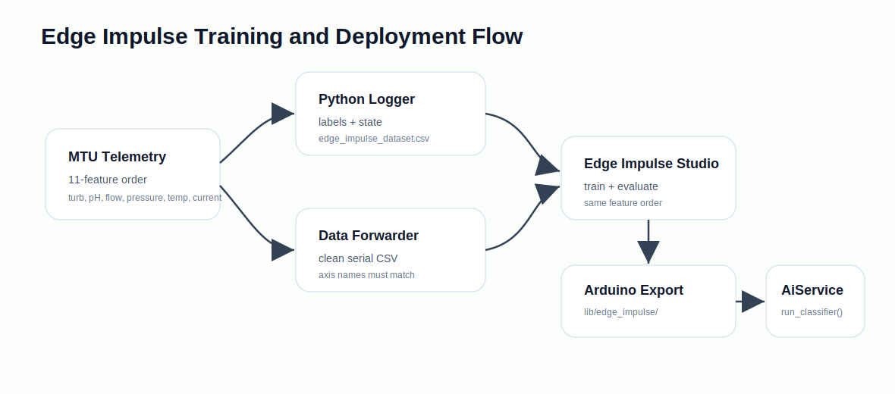
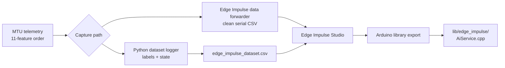

# Edge Impulse Model Integration


Place the exported Edge Impulse Arduino library in this folder after training.

The firmware integration point is `firmware/MTU/src/AiService.cpp`. Edge
Impulse is disabled by default:

```cpp
#define ENABLE_EDGE_IMPULSE 0
```

## Current Feature Vector

The MTU feature vector is now 11 values:

| Index | Feature | Unit/status |
|---:|---|---|
| 0 | `turb1` | turbidity before filter, percent |
| 1 | `turb2` | turbidity after filter, percent |
| 2 | `ph1` | pH before filter |
| 3 | `ph2` | pH after filter |
| 4 | `flow1` | flow before filter, L/min |
| 5 | `flow2` | flow after filter, L/min |
| 6 | `press1` | pressure before filter, bar |
| 7 | `press2` | pressure after filter, bar |
| 8 | `temp1` | optional temperature before filter |
| 9 | `temp2` | optional temperature after filter |
| 10 | `pump_current` | optional pump current, amps |

`EI_FEATURES_COUNT` must stay in sync with this list.

## Training Flow





For Python-side CSV collection, the dataset file includes extra context fields:

```text
timestamp_ms,...features...,pump_on,state,error,label
```

## Data Collection Options

### Option A: Python Dataset Logger

This is the current recommended path because it preserves labels and station
state in `ai/logs/edge_impulse_dataset.csv`.

1. Upload normal MTU firmware with serial telemetry enabled.
2. Run the Python controller:

   ```bash
   cd ai
   python main.py
   ```

3. Set a label:

   ```bash
   curl -X POST http://localhost:5000/api/dataset/label ^
     -H "Content-Type: application/json" ^
     -d "{\"label\":\"normal\"}"
   ```

4. Collect CSV rows from `ai/logs/edge_impulse_dataset.csv`.

### Option B: Edge Impulse Data Forwarder

This sends clean CSV lines directly over ESP32 serial.

1. In `firmware/MTU/src/Config.h`:

   ```cpp
   #define ENABLE_DATA_FORWARDER 1
   #define ENABLE_EDGE_IMPULSE   0
   ```

2. Build and upload:

   ```bash
   cd firmware/MTU
   pio run -e esp32s3_n16r8 -t upload
   ```

3. Run:

   ```bash
   edge-impulse-data-forwarder --frequency 20
   ```

4. Use these axis names:

   ```text
   turb1,turb2,ph1,ph2,flow1,flow2,press1,press2,temp1,temp2,pump_current
   ```

Data forwarder mode disables normal JSON serial telemetry while it is enabled.

## Export and Enable Inference

1. Train in Edge Impulse Studio with the same feature count/order.
2. Export as an Arduino library.
3. Extract the library contents into this folder.
4. In `Config.h`:

   ```cpp
   #define ENABLE_DATA_FORWARDER 0
   #define ENABLE_EDGE_IMPULSE   1
   ```

5. Update `AiService.cpp` to include the generated inference header and call
   the generated classifier in `AiService::run()`.
6. Build and upload:

   ```bash
   pio run -e esp32s3_n16r8 -t upload
   ```

AI results are available in:

- serial telemetry/state flow
- `GET /api/ai`
- WebSocket status on port 81
- dashboard UI

## Notes

- Do not enable `ENABLE_DATA_FORWARDER` and `ENABLE_EDGE_IMPULSE` together.
- Optional temperature/current sensors can be trained later, but the model input
  order must still match firmware and dataset order.
- Pump-current overload detection is represented by `pump_current` and the
  `MAX_PUMP_CURRENT` threshold in firmware.
