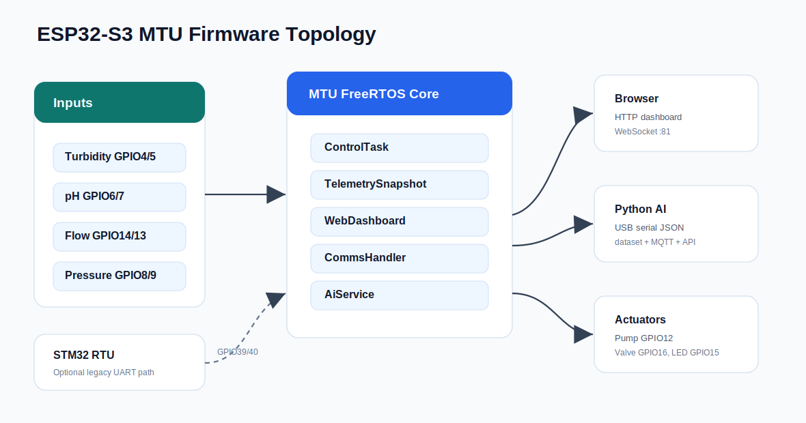
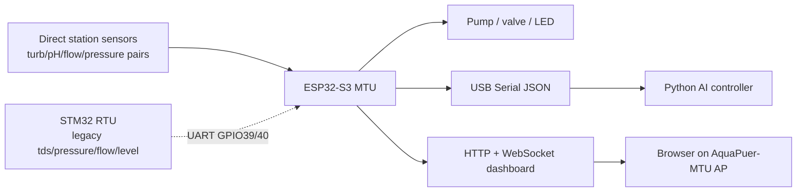

# AquaPuer Firmware

Embedded firmware for the Smart Water Station.

| Unit | Folder | MCU | Role |
|---|---|---|---|
| MTU | `MTU/` | ESP32-S3 | Main controller, direct sensors, WiFi AP, dashboard, REST/WebSocket, serial telemetry |
| RTU | `RTU/` | STM32F103C8 | Optional/legacy remote unit that sends 4-field UART frames |

## Firmware Topology





The current station build mainly uses the MTU as the direct sensor reader. The
RTU link is enabled, but the RTU firmware still sends the older
`tds/pressure/flow/level` frame. Upgrade the RTU payload before relying on it
for the full before/after-filter schema.

## MTU Pin Map

Defined in `MTU/src/Config.h`.

| Signal | ESP32-S3 GPIO | Notes |
|---|---:|---|
| Turbidity 1 | 4 | before filter |
| Turbidity 2 | 5 | after filter |
| pH 1 | 6 | before filter |
| pH 2 | 7 | after filter |
| Pressure 1 | 8 | before filter/input |
| Pressure 2 | 9 | after filter/output |
| Flow 1 | 14 | interrupt pulse input |
| Flow 2 | 13 | interrupt pulse input |
| Pump relay | 12 | digital output |
| Valve relay | 16 | digital output |
| Status LED | 15 | digital output |
| LCD SDA | 18 | I2C |
| LCD SCL | 17 | I2C |
| RTU RX | 39 | UART from STM32 TX |
| RTU TX | 40 | UART to STM32 RX |
| Temperature 1 | 11 | optional, disabled by default |
| Temperature 2 | 21 | optional, disabled by default |
| Pump current | 2 | optional ADC, disabled by default |

## Feature Flags

```cpp
#define ENABLE_WEB_DASHBOARD 1
#define ENABLE_RTU_LINK 1
#define ENABLE_EDGE_IMPULSE 0
#define ENABLE_HMI_DISPLAY 0
#define ENABLE_DATA_FORWARDER 0
#define ENABLE_TEMPERATURE_SENSORS 0
#define ENABLE_PUMP_CURRENT_SENSOR 0
#define SIMULATION_MODE false
```

## UART Wiring

The LCD uses GPIO17/GPIO18, so the RTU UART has been moved:

```text
STM32 PA9  (TX) -> ESP32 GPIO39 (PIN_RTU_RX)
STM32 PA10 (RX) <- ESP32 GPIO40 (PIN_RTU_TX)
GND             -> GND
```

Use 3.3V logic only.

## MTU Web Server

The ESP32 serves the built dashboard from `MTU/data` using LittleFS.

| Path | Purpose |
|---|---|
| `/` | dashboard SPA |
| `/api/status` | full JSON status |
| `/api/control` | command endpoint |
| `/api/config` | firmware/config summary |
| `/api/ai` | Edge Impulse result summary |
| `/health` | simple health check |
| WebSocket `:81/` | live status + command channel |

## Build

```bash
# MTU firmware
cd firmware/MTU
pio run -e esp32s3_n16r8

# MTU LittleFS image
pio run -e esp32s3_n16r8 -t buildfs

# RTU firmware
cd ../RTU
pio run -e bluepill_f103c8
```

## Upload

```bash
# ESP32 firmware
cd firmware/MTU
pio run -e esp32s3_n16r8 -t upload

# ESP32 dashboard filesystem
pio run -e esp32s3_n16r8 -t uploadfs

# STM32 RTU
cd ../RTU
pio run -e bluepill_f103c8 -t upload
```

If the ESP32 serves a blank or old dashboard, rebuild the web app and upload the
filesystem image again.
