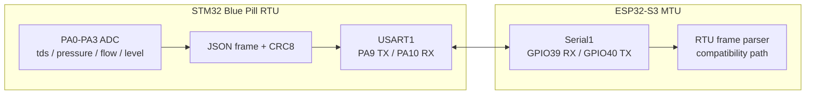

# AquaPuer RTU - Remote Terminal Unit


The RTU is the STM32 Blue Pill firmware for remote sensor acquisition. In the
current repository it is still the legacy 4-sensor implementation:

- `tds`
- `pressure`
- `flow`
- `level`

The MTU has moved to a richer before/after-filter schema
(`turb1/turb2`, `ph1/ph2`, `press1/press2`, `flow1/flow2`, optional
temperature, optional pump current). Because of that, treat this RTU firmware as
optional/legacy until its payload is upgraded to the same schema.

## Link Diagram




## Features

| Feature | Description |
|---|---|
| ADC sampling | Reads 4 analog channels |
| Smoothing | 8-sample averaged ADC reads |
| Fault detection | Flags near-rail ADC values as open/short faults |
| CRC8 | Appends CRC8 to each JSON frame |
| Watchdog | IWDG 4-second hardware watchdog |
| Commands | Receives `SET_INTERVAL` over UART |
| Status LED | Normal blink when healthy, fast blink on sensor fault |

## Sensor Pins

| Signal | STM32 pin | Range | Unit |
|---|---|---:|---|
| TDS | PA0 | 0-1000 | PPM |
| Pressure | PA1 | 0-150 | PSI |
| Flow | PA2 | 0-100 | L/min |
| Water level | PA3 | 0-100 | % |
| Status LED | PC13 | - | - |

## MTU UART Wiring

The MTU LCD uses GPIO17/GPIO18, so the RTU UART is wired to GPIO39/GPIO40 on the
ESP32-S3:

| STM32 Blue Pill | Direction | ESP32-S3 MTU |
|---|---|---|
| PA9 TX | RTU -> MTU | GPIO39 `PIN_RTU_RX` |
| PA10 RX | MTU -> RTU | GPIO40 `PIN_RTU_TX` |
| GND | common | GND |

Both boards use 3.3V logic. Do not use 5V UART levels.

## Frame Format

Every `RTU_FRAME_INTERVAL_MS` milliseconds, default 200 ms:

```json
{"type":"rtu_frame","seq":42,"tds":250.00,"pressure":45.00,"flow":0.00,"level":75.00,"err":0,"ts":8400,"crc":123}
```

| Field | Description |
|---|---|
| `type` | always `"rtu_frame"` |
| `seq` | increasing sequence number |
| `tds` | TDS in PPM, or `-1.0` on sensor fault |
| `pressure` | pressure in PSI, or `-1.0` on sensor fault |
| `flow` | flow in L/min, or `-1.0` on sensor fault |
| `level` | water level %, or `-1.0` on sensor fault |
| `err` | sensor error bitmask |
| `ts` | milliseconds since boot |
| `crc` | CRC8 of the JSON payload before `,"crc":` |

Error flags:

| Bit | Value | Meaning |
|---:|---:|---|
| 0 | `0x01` | TDS sensor fault |
| 1 | `0x02` | Pressure sensor fault |
| 2 | `0x04` | Flow sensor fault |
| 3 | `0x08` | Level sensor fault |

## Commands

```json
{"cmd":"SET_INTERVAL","value":100}
```

`SET_INTERVAL` accepts 50-5000 milliseconds.

## Build and Upload

Requires PlatformIO and an ST-Link programmer.

```bash
cd firmware/RTU
pio run -e bluepill_f103c8
pio run -e bluepill_f103c8 -t upload
```
