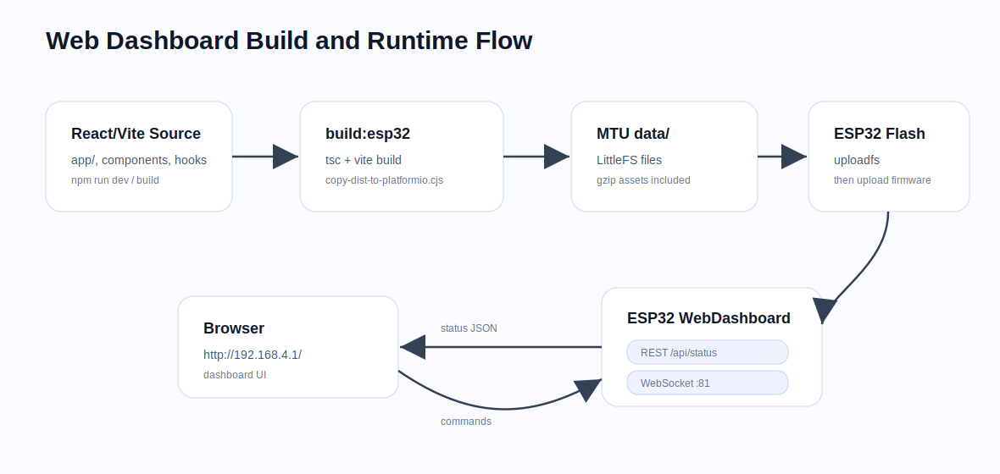
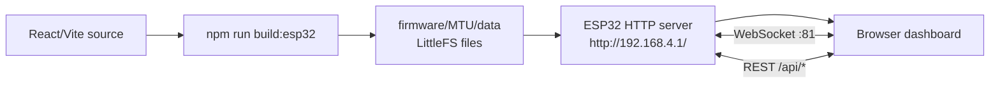

# AquaPuer Web Dashboard

React/Vite dashboard source for the Smart Water Station. It runs locally during
development and builds into static files served by the ESP32-S3 from LittleFS.


## Runtime Flow





## ESP32 Connection

`lib/use-water-station.ts` manages the station connection.

| Channel | Current behavior |
|---|---|
| WebSocket | Connects to `ws://<current-host>:81/` |
| Telemetry | Receives full MTU status JSON |
| Commands | Sends shared firmware commands |
| Fallback | Runs local simulation when ESP32 is unreachable |

Command examples:

```json
{"cmd":"SET_PUMP","state":true}
{"cmd":"SET_MODE","state":true}
```

ESP32 endpoints:

| URL | Purpose |
|---|---|
| `http://192.168.4.1/` | dashboard from LittleFS |
| `http://192.168.4.1/api/status` | full status JSON |
| `http://192.168.4.1/api/control` | REST command endpoint |
| `http://192.168.4.1/api/config` | firmware/config summary |
| `http://192.168.4.1/api/ai` | AI result summary |
| `ws://192.168.4.1:81/` | live status + commands |

## Development

```bash
cd web/Smart-Water-Station-main
npm install
npm run dev
```

Default local URL:

```text
http://localhost:5173
```

Useful checks:

```bash
npm run build
npm run lint
```

This is a Vite app, not a Next.js app. ESLint is configured directly for Vite,
React, and TypeScript.

## Build for ESP32

```bash
npm run build:esp32
```

This runs:

1. `tsc -b`
2. `vite build`
3. `scripts/copy-dist-to-platformio.cjs`

The copy script deletes the old `firmware/MTU/data` dashboard files, copies the
current Vite `dist/` output, and creates `.gz` copies for compressible assets.

Then flash the filesystem image:

```bash
cd ../../firmware/MTU
pio run -e esp32s3_n16r8 -t uploadfs
```

Upload firmware too when firmware code changed:

```bash
pio run -e esp32s3_n16r8 -t upload
```

If the ESP32 connects but the browser shows a blank page, the most likely cause
is that the LittleFS image was not uploaded after the latest web build.

## Project Structure

```text
Smart-Water-Station-main/
|-- app/
|   |-- main.tsx
|   |-- App.tsx
|   |-- page.tsx
|   |-- globals.css
|   `-- */page.tsx
|-- _components/
|-- hooks/
|-- lib/
|   |-- use-water-station.ts
|   `-- utils.ts
|-- Interfaces/
|-- Project photos/
|-- public/
|-- scripts/
|   `-- copy-dist-to-platformio.cjs
|-- vite.config.ts
|-- tsconfig.json
`-- package.json
```

## Sensor Naming

The firmware exposes the richer sensor names:

```text
turb1,turb2,ph1,ph2,flow1,flow2,press1,press2,temp1,temp2,pump_current
```
